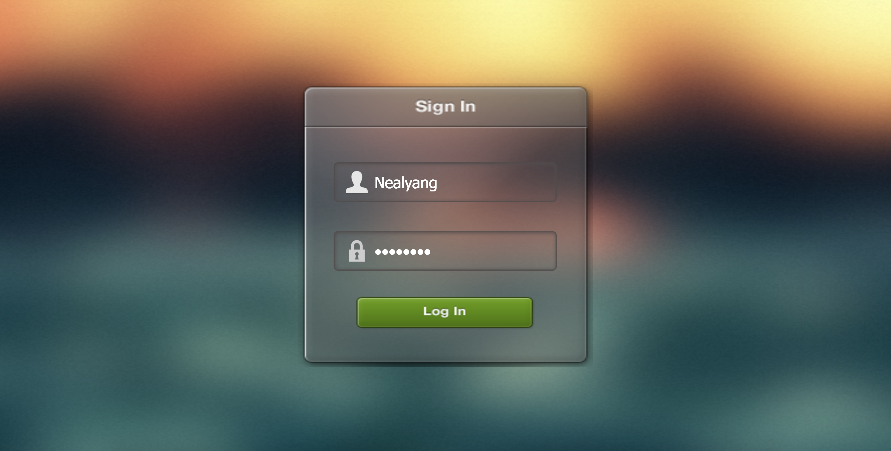
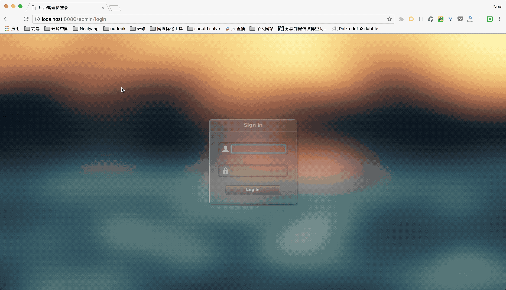
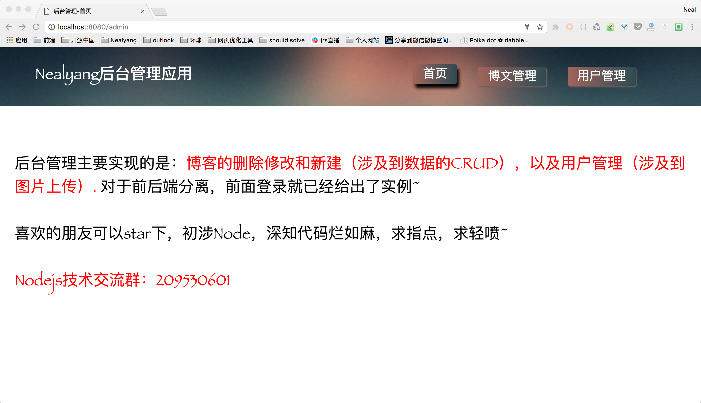
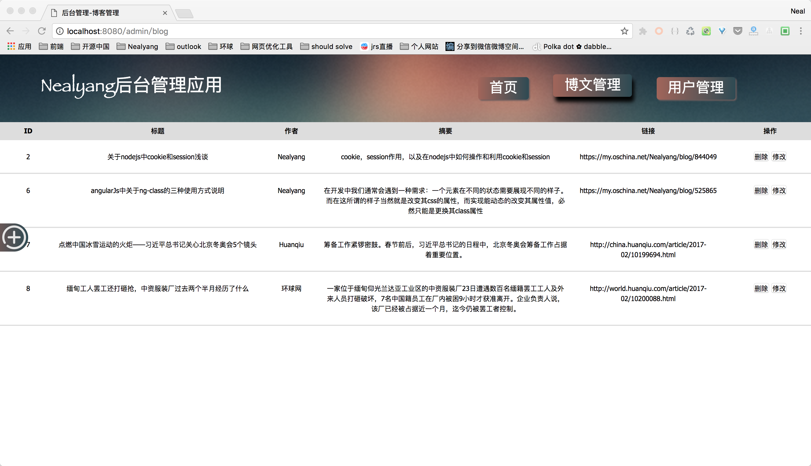
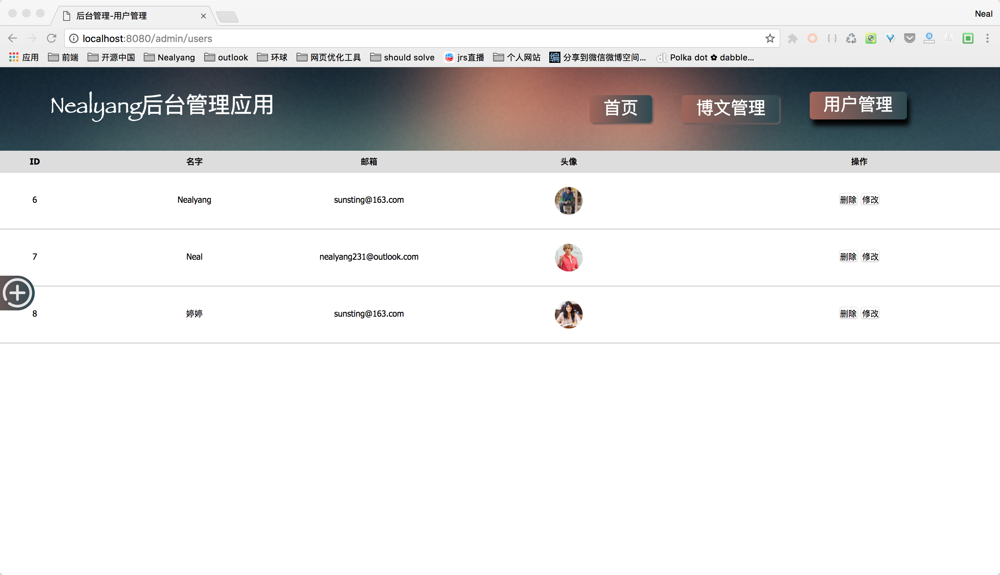
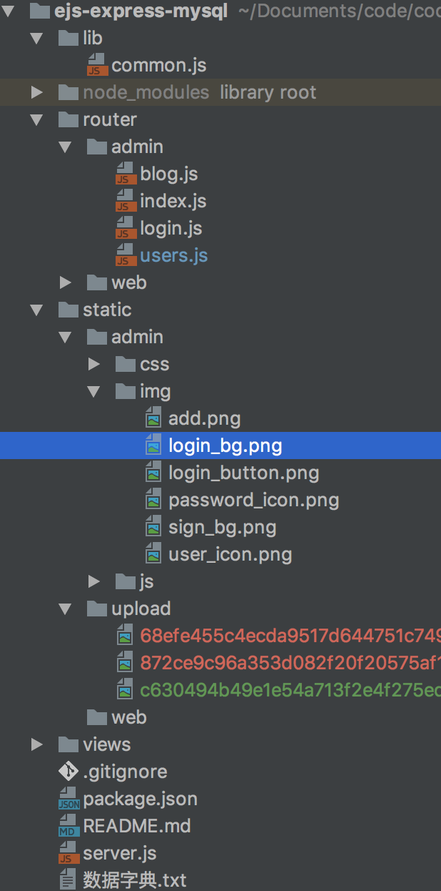

ejs-express-mysql
==

###[基于express，MySQL，ejs实现的一个简单基本的网站后台管理应用](https://github.com/Nealyang/ejs-express-mysql)

##前言
也是这两周才正式的接触node，虽然在前端开发中我们常常说前后端分离，但是在学习过程中，个人感觉还是要刁难刁难自己的。因为用ejs来写前端页面。
项目主要实现用户的登录，session的存储和加密（准确的说是签名），数据库的CRUD，包括图片的上传，删除和修改等基本功能。
关于登录，查询等操作本应该更加的严谨，这里只做简单演示。包括一些配置文件的编写。
    
---
喜欢的朋友方便的话可以给个star  (＾－＾)V

顺便推广一波nodejs技术交流群，群号:209530601
***

>ejs mysql nodejs express express-router...

##效果图

登录页

整体操作流程图

**GIF Brewery转gif真的有点。。。好吧，不吐槽了，后面会分开讲解每一步，好在基本操作还能看得清~**

后台管理首页

博文管理

用户管理页

操作

##开发准备
关于开发前期的准备，这里就不多说了，说实话，自己也没有准备啥，关于nodejs环境，MySQL配置啥的就多少了，关于本项目的[数据字典](./数据字典.txt)，还有[SQL文件](./resources/blog.sql)已经在目录里了，这里主要说下后端开发的每一个步骤
##项目目录
项目目录

##整体架构
项目重点在后端开发中，web端页面并没有涉及到，后端管理流程大致如下:
* 路由控制分为admin，web，还是那句话，我们操作全部在admin中
* 跳转到admin拦截所有的请求，判断用户是否登录
* 未登录则重定向到登录，登陆成功后设置session。[不懂session？点击这里](https://my.oschina.net/Nealyang/blog/844049)
* 登录后则可进行相关的操作，数据的增删改查等功能。
##后端开发
###后台基本架构、路由设置
        const express = require('express');
        const expressStatic = require('express-static');
        const bodyParser = require('body-parser');
        const multer = require('multer');
        const multerObj = multer({dest:'./static/upload'});
        const cookieParser = require('cookie-parser');
        const cookieSession = require('cookie-session');
        const consolidate = require('consolidate');
        const ejs = require('ejs');
        
        //创建服务器
        var server = express();
        server.listen(8080);
        
        //解析请求数据
        
        server.use(bodyParser({
            extended:false
        }));
        server.use(multerObj.any());
        
        //设置cookie，session
        server.use(cookieParser('Neal_signed'));
        (function () {
            var arr = [];
            for(var i = 0;i<10000;i++){
                arr.push('keys_'+Math.random());
            }
            server.use(cookieSession({
                name:'session_id',
                keys:arr,
                maxAge:20*60*1000//一般我会设置20分钟，这里是为了感受session过期~~带来的快感~?(●´∀｀●)ﾉ
            }))
        })();
        
        //设置模板
        server.set('view engine','html');
        server.set('views','./views');
        server.engine('html',consolidate.ejs);
        //设置路由
        server.use('/admin',require('./router/admin/index')());
        server.use('/',require('./router/web/index')());
        
        
        //静态文件的请求
        server.use('/files',expressStatic('./static'));
我的基本架构如下，关于每一部分的功能，都已经标注。关于路由的控制在admin/index.js跟server.js大同小异，我想大家也都应该知道了。
###登录功能
登录功能这里主要说两点
* 密码的md5签名（当然，大多数人说是md5加密）
* session的应用
在lib中存放着自己写的一些方法，作为一个库，admin初始化有三个用户，包括u/p：root,neal,Nealyang
关于密码的签名方法主要如下：
        var crypto = require('crypto');
        
        module.exports = {
            MD5_SUFFIX : 'JDSAIOEUQOIoieuoiqv#$%^&dhfja)(* %^&FGHJfyuieyfhfhak(^.^)YYa!!\(^o^)/Y(^o^)Y(*^__^*)ﾍ|･∀･|ﾉ*~●',
            md5:function (pwd) {
                var md5 = crypto.createHash('md5');
                return md5.update(pwd).digest('hex');
            }
        };
MD5_SUFFIX是加密字符串，用法如路由login.js：

        
            router.post('/',function (req,res) {
                var username = req.body.username;
                var password = common.md5(req.body.password+common.MD5_SUFFIX);
                if(username && password){
                    db.query('SELECT * FROM admin_table WHERE username="'+username+'"',function (err,userData) {
                        if(err){
                            console.error(err);
                            res.status(500).send({code:500,data:[],msg:'database error'});
                        }else if(userData.length == 0){
                            res.status(400).send({code:400,data:[],msg:'parameters error'});
                        }else{
                            if(userData[0].password != password){
                                res.status(400).send({code:400,data:[],msg:'username or password error'});
                            }else{
                                req.session['user_id'] = userData[0].ID;//注意这里是在req上面
                                res.status(200).send({code:200,data:[],msg:'success'});
                            }
                        }
                    })
                }else{
                    res.status(400).send({code:400,data:[],msg:'parameters error'});
                }
            });
从上面的代码中也展现了什么时候设置session，并且值得提一下的是这里提供给前端页面的是接口，这样的话很多逻辑都放到了前端，后面我们都是通过页面渲染来输出的了。下面是所有请求的拦截判断：

        router.use(function (req,res,next) {
                if(!req.session['user_id'] && req.url != '/login'){
                    res.redirect('/admin/login');
                }else{
                    next();
                }
            });

##ejs前端页面的重点代码讲解
公共头部的引入：

        <% include common/top.ejs %>
        
查询数据库的前端展示：

        <% for(var i = 0;i<formData.length;i++){%>
            <tr>
                <td><%=formData[i].ID%></td>
                <td><%=formData[i].title%></td>
                <td><%=formData[i].author%></td>
                <td><%=formData[i].summary%></td>
                <td><%=formData[i].href%></td>
                <td>
                    <a href="?action=del&id=<%=formData[i].ID%>" onclick="return confirm('确定删除？')">
                        <button>删除</button>
                    </a>
                    <a href="?action=mod&id=<%=formData[i].ID%>">
                        <button>修改</button>
                    </a>
                </td>
            </tr>
            <%}%>

修改后我们通过页面给的标识来知道是否为修改的提交，毕竟这里我们没有前端逻辑的js

        <%if(typeof modData != 'undefined'){%>
        

            
            

            <form action="?" method="post">
                <input type="hidden" name="modified" value="<%= modData[0].ID %>">
                标题: <input type="text" name="title" autofocus="autofocus" value="<%=modData[0].title%>"> 
                作者: <input type="text" name="author" value="<%=modData[0].author%>"> 
                摘要: <textarea name="summary"><%=modData[0].summary%></textarea> 
                链接: <input type="text" name="href" value="<%=modData[0].href%>"> 
                <input type="submit" value="确认修改">
            </form>
        

        <%}%>

##博文管理
还是那句话，如果是仅仅提供前端的接口的话，这里会方便很多，然后我们用的是ejs，所以很多的逻辑都放在了后端，在get/post到请求的时候需要做很多判断
get方法请求如下：

        router.get('/', function (req, res) {
                switch (req.query.action) {
                    case 'del':
                        //删除操作
                        db.query('DELETE FROM blog_list_table WHERE id="'+req.query.id+'"',function (err,resultData) {
                            if(err){
                                console.error(err);
                                res.status(500).send({code:500,msg:'database error'});
                            }else{
                                res.redirect('/admin/blog');
                            }
                        });
                        break;
                    case 'mod':
                        //修改操作
                        db.query('SELECT * FROM blog_list_table WHERE id="'+req.query.id+'"',function (err,modData) {
                            if(err){
                                console.error(err);
                                res.status(500).send({code:500,msg:'database error'});
                            }else if(modData.length == 0){
                                res.status(400).send({code:400,msg:'parameters error'});
                            }else{
                                db.query('SELECT * FROM blog_list_table',function (err,allData) {
                                    if(err){
                                        console.error(err);
                                        res.status(500).send({code:500,msg:'database error'});
                                    }else{
                                        res.render('admin/blog.ejs',{formData:allData,modData:modData});
                                    }
                                });
                            }
                        });
                        break;
                    default:
                        db.query('SELECT * FROM blog_list_table', function (err, resultData) {
                            if (err) {
                                console.error(err);
                                res.status(500).send({code: 500, msg: 'database error'}).end();
                            } else {
                                res.render('admin/blog.ejs', {formData: resultData});
                            }
                        });
                }
        
            });
这里的switch，主要是分为，查询，删除，和修改
都是些简单的CRUD操作，这里就不多细说了。不熟悉的兄弟们可以看一看，写的不好，多多提意见。

同理，post的请求，主要就是分为，文章列表的添加，和修改的两个post，代码如下：

        router.post('/', function (req, res) {
                //此处验证应该更加严格，比如正则
                var title = req.body.title.trim();
                var author = req.body.author.trim();
                var summary = req.body.summary.trim();
                var href = req.body.href.trim();
        
                if (title && author && summary && href) {
                    if(req.body.modified){
                        db.query('UPDATE blog_list_table SET title="'+title+'",author="'+author+'",summary="'+summary+'",href="'+href+'" WHERE ID="'+req.body.modified+'"',function (err,resultData) {
                            if(err){
                                console.error(err);
                                res.status(500).send({code:500,msg:'database error'});
                            }else{
                                res.redirect('/admin/blog');
                            }
                        })
                    }else{
                        db.query('INSERT INTO blog_list_table (title,author,summary,href) VALUE("' + title + '","' + author + '","' + summary + '","' + href + '")', function (err, data) {
                            if (err) {
                                console.error(err);
                                res.status(500).send({code: 500, msg: 'database error'}).end();
                            } else {
                                res.redirect('/admin/blog');
                            }
                        });
                    }
                } else {
                    res.status(400).send({code: 400, msg: 'parameters error'}).end();
                }
        
            });

##用户管理
后台的管理大概也即是这么多，用户管理和博文管理基本都是差不多的，这里重点是说下，这里用到的图片上传。
图片上传我用的是**multer**中间件，不知道的可以查下，注意用这个中间件接受图片上传时form表单的**enctype**必须要设置为multipart/form-data

关于图片上传后，默认是不包括后缀名的，所以这里我们需要用到fs模块的重命名操作，代码如下：

        fs.rename(req.files[0].path, req.files[0].path + ext, function (err) {
                        if (err) {
                            console.error(err);
                            res.status(500).send({code: 500, msg: 'data error'});
                        } else {
                            db.query('INSERT INTO user_table (username,email,pic_header) VALUE("' + username + '","' +
                                email + '","' + pic_header + '")', function (err, resultData) {
                                if (err) {
                                    console.error(err);
                                    res.status(500).send({code: 500, msg: 'database error'});
                                } else {
                                    res.redirect('/admin/users');
                                }
                            });
                        }
                    });
前面的变量定义主要如下：

        var username = req.body.username;
                var email = req.body.email;
                if(req.files.length>0){
                    var ext = pathLib.parse(req.files[0].originalname).ext;
                    var pic_header = '/files/upload/' + req.files[0].filename + ext;
                }
用到path模块对路径的解析。为了获取后缀名~

说到这，对于修改也就很简单了，就是删除原先有的那个图片，然后换上现在有的图片，具体代码如下：

        //需要进行一些校验，这里就忽略了
                if(req.body.modified){//修改
                    //查看有没有新传来的头像，如果有，则删除，新建，如果没有，直接更新需要更新的内容
                    if(req.files.length>0){
                        //有修改头像，则进行原来头像的删除，再上传
                        db.query('SELECT * FROM user_table WHERE ID="'+req.body.modified+'"',function (err,modData) {
                            if (err) {
                                console.error(err);
                                res.status(500).send({code: 500, msg: 'database error'});
                            }else if(modData.length == 0){
                                res.status(400).send({code: 400, msg: 'parameters error'});
                            }else{
                                fs.unlink(modData[0].pic_header.replace('\/files','static'),function (err) {
                                    if(err){
                                        console.error(err);
                                        res.status(500).send({code:500,msg:'operate error'});
                                    }else{
                                        //删除成功，开始对新的文件进行重命名
                                        fs.rename(req.files[0].path, req.files[0].path + ext, function (err) {
                                            if (err) {
                                                console.error(err);
                                                res.status(500).send({code: 500, msg: 'operate error'});
                                            } else {
                                                db.query('UPDATE user_table SET username="'+
                                                    username+'",email="' + email + '",pic_header="' +
                                                    pic_header + '" WHERE ID="'+req.body.modified+'"',function (err,data) {
                                                    if (err) {
                                                        console.error(err);
                                                        res.status(500).send({code: 500, msg: 'database error'});
                                                    }else{
                                                        res.redirect('/admin/users');
                                                    }
                                                });
                                            }
                                        });
                                    }
                                })
                            }
                        })
                    }else{
                        db.query('UPDATE user_table SET username="'+username+'",email="' + email + '" WHERE ID="'+
                            req.body.modified+'"',function (err,data) {
                            if (err) {
                                console.error(err);
                                res.status(500).send({code: 500, msg: 'database error'});
                            }else{
                                res.redirect('/admin/users');
                            }
                        });
                    }
                }

看到这个代码是不是感觉想死的心都有了？？？的确，多少篇文章都说到了关于nodejs的回调地狱，但是Node 7.6 发布了，支持了async函数，JavaScript异步的写法彻底改变了。所以这个大可不必太过于担心
况且Koa不就这么的出来和投入大范围的使用了嘛，这里我们大可用express，去尽情的感受Node的魅力。

##结束语
说到这，基本的一个小小后台管理应用就完事了，是不是感觉没有想象中的那么难？写的不好，欢迎大家吐槽指教~~~
最后，欢迎愿意一起学习nodejs的朋友加入，Nodejs技术群:209530601
~~